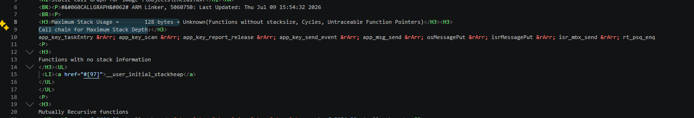

# stm32key

基于 STM32F103RC 和 Keil MDK 的按键、状态机与 OLED 显示示例工程。工程使用 CMSIS-RTOS RTX 组织多任务，通过 Message Queue 和 Mail Queue 解耦 KEY、Power、CD 和 OLED 模块。

## 目录

- [工程概览](#工程概览)
- [功能](#功能)
- [目录结构](#目录结构)
- [运行结构](#运行结构)
- [任务调度](#任务调度)
- [模块通信](#模块通信)
- [任务创建](#任务创建)
- [栈配置与分析](#栈配置与分析)
- [构建方法](#构建方法)
- [主要配置](#主要配置)
- [版本管理说明](#版本管理说明)

## 工程概览

- 主控: STM32F103RC, Cortex-M3, 72 MHz
- 工程文件: `chezai.uvprojx`
- 目标名: `Target 1`
- 输出文件: `Objects/chezai.hex`
- RTOS: CMSIS-RTOS RTX, CMSIS-RTOS v1 API
- 显示: I2C OLED, 地址 `0x78`, SCL `PB6`, SDA `PB7`
- 按键: `WKUP` 位于 `PA0`, `KEY0` 位于 `PC1`, `KEY1` 位于 `PC13`

## 功能

- 三路按键扫描，支持短按、长按和释放事件。
- `WKUP` 短按开机，`WKUP` 长按关机。
- `KEY0` 短按执行装载或弹出，长按切换上一曲。
- `KEY1` 短按播放或暂停，长按切换下一曲。
- CD 状态机覆盖关机、无碟、装载、弹出、停止、播放、暂停等状态。
- OLED 根据电源状态、CD 状态和曲目编号刷新显示，并带有开机显示/动画入口。
- 独立看门狗在 RTX idle 任务中喂狗。

## 目录结构

```text
App/
  App_CD/       CD 状态机和 CD 任务
  App_KEY/      按键扫描、消抖、长按定时
  App_OLED/     OLED 显示任务和动画
  App_Power/    电源状态任务
BSP/            GPIO、按键、OLED I2C、IWDG 等板级驱动
Common/         公共类型、错误码、配置和消息封装
Core/           main 入口与任务、队列创建
RTE/            Keil RTE 与 CMSIS-RTOS RTX 配置
DebugConfig/    Keil 调试配置
```

根目录下的中文 Markdown 文档记录了模块状态机、线程通信和按键到 OLED 的数据链路，适合配合源码阅读。

## 运行结构

| 任务 | 入口函数 | 优先级 | 主要等待方式 | 职责 |
| --- | --- | --- | --- | --- |
| KEY | `app_key_taskEntry` | `osPriorityAboveNormal` | `osDelay(10 ms)` | 扫描按键、消抖、产生短按/长按/释放事件 |
| Power | `app_power_taskEntry` | `osPriorityNormal` | `app_msg_get(..., osWaitForever)` | 处理上下电状态，并通知 CD/OLED |
| CD | `app_cd_taskEntry` | `osPriorityBelowNormal` | `app_msg_get(..., osWaitForever)` | 运行 CD 状态机，生成 OLED 显示数据 |
| OLED | `app_oled_taskEntry` | `osPriorityLow` | `osMailGet(..., 50 ms)` | 接收 Power/CD/OLED Mail，刷新屏幕 |
| RTX Timer | `osTimerThread` | High | RTX 内部消息邮箱 | 执行软件定时器回调 |
| Idle | `os_idle_demon` | Idle | 无就绪任务时运行 | 喂独立看门狗 |

## 任务调度

RTX 使用抢占式优先级调度。业务任务按实时性分层: KEY 响应按键最高，Power 处理上下电状态居中，CD 状态机低于 Power，OLED 刷屏最低。

当前调度配置在 `RTE/CMSIS/RTX_Conf_CM.c`:

```c
#define OS_TICK        1000
#define OS_ROBIN       1
#define OS_ROBINTOUT   5
```

- `OS_TICK = 1000`: 系统 tick 为 1 ms。
- `OS_ROBIN = 1`: 同优先级任务启用 round-robin 时间片；当前业务任务优先级已分层，所以主要作为后续扩展保护。
- `OS_ROBINTOUT = 5`: 同优先级就绪任务每 5 ms 轮转一次。

实际运行时，大部分业务任务并不会一直占用 CPU:

- KEY 任务每 10 ms 扫描一次按键，然后 `osDelay()` 让出 CPU。
- Power 和 CD 任务长期阻塞在各自的 Message Queue 上，收到消息才运行。
- OLED 任务阻塞等待 `g_oledMailQueue`，超时周期为 50 ms。
- OLED 任务优先级最低，I2C 刷屏和开机动画不会压住按键扫描和电源状态处理。
- 软件定时器回调由 RTX Timer 线程执行；回调里只发送事件，不做长时间显示或复杂业务。
- 没有业务任务就绪时进入 `os_idle_demon()`，在那里喂看门狗。

典型调度链路:

```text
KEY 扫描到按键
  -> 向 Power/CD 队列发送 AppMsg
  -> Power/CD 从阻塞态被唤醒
  -> Power 或 CD 产生 OledMail
  -> OLED 从 Mail Queue 唤醒并刷新显示
```

## 模块通信

`Core/main.c` 创建全局消息池、两个 Message Queue 和一个发往 OLED 的 Mail Queue。

| 队列 | 类型 | 长度 | 发送方 | 接收方 | 数据 |
| --- | --- | ---: | --- | --- | --- |
| `g_powerMsgQueue` | Message Queue | `QUEUE_POWER_LEN = 8` | KEY | Power | `AppMsg *` |
| `g_cdMsgQueue` | Message Queue | `QUEUE_CD_LEN = 8` | KEY、Power、CD 定时器 | CD | `AppMsg *` |
| `g_oledMailQueue` | Mail Queue | `MAIL_OLED_LEN = 8` | Power、CD、OLED 定时器 | OLED | `OledMail` |

Message Queue 使用 `Common/app_msg.c` 封装: 发送端从 `g_appMsgPool` 申请 `AppMsg`，通过 `osMessagePut()` 发送指针，接收端处理后调用 `app_msg_free()` 释放。

OLED 接收 Power 和 CD 时统一使用 Mail Queue:

```c
mail = (OledMail *)osMailAlloc(g_oledMailQueue, 0U);
osMailPut(g_oledMailQueue, mail);

evt = osMailGet(g_oledMailQueue, timeout);
osMailFree(g_oledMailQueue, mail);
```

OLED 根据 `mail->msgId` 分流:

| `msgId` | 来源 | 作用 |
| --- | --- | --- |
| `MSG_ID_POWER_STATE` | Power | 更新上下电状态 |
| `MSG_ID_CD_STATE` | CD | 更新 CD 状态、显示模式和曲目编号 |
| `MSG_ID_OLED_REFRESH` | OLED 定时器 | 结束开机显示并刷新页面 |

## 任务创建

线程定义集中在 `Core/main.c`:

```c
osThreadDef(app_key_taskEntry,   TASK_KEY_PRIORITY, 1U, TASK_KEY_STACK_SIZE);
osThreadDef(app_power_taskEntry, TASK_POWER_PRIORITY, 1U, TASK_POWER_STACK_SIZE);
osThreadDef(app_cd_taskEntry,    TASK_CD_PRIORITY, 1U, TASK_CD_STACK_SIZE);
osThreadDef(app_oled_taskEntry,  TASK_OLED_PRIORITY, 1U, TASK_OLED_STACK_SIZE);
```

真正创建线程的是 `sys_task_init()`:

```c
s_keyQueues[0] = g_cdMsgQueue;
s_keyQueues[1] = g_powerMsgQueue;

osThreadCreate(osThread(app_key_taskEntry), (void *)s_keyQueues);
osThreadCreate(osThread(app_power_taskEntry), NULL);
osThreadCreate(osThread(app_cd_taskEntry), NULL);
osThreadCreate(osThread(app_oled_taskEntry), NULL);
```

KEY 任务需要同时向 CD 和 Power 发消息，所以入口参数传入 `s_keyQueues`；Power、CD、OLED 使用全局队列句柄，不需要额外入口参数。

## 栈配置与分析

线程栈大小定义在 `Common/com_config.h`:

```c
#define TASK_KEY_PRIORITY           osPriorityAboveNormal
#define TASK_POWER_PRIORITY         osPriorityNormal
#define TASK_CD_PRIORITY            osPriorityBelowNormal
#define TASK_OLED_PRIORITY          osPriorityLow

#define TASK_KEY_STACK_SIZE         512U
#define TASK_POWER_STACK_SIZE       512U
#define TASK_CD_STACK_SIZE          768U
#define TASK_OLED_STACK_SIZE        768U
```

RTX 相关配置在 `RTE/CMSIS/RTX_Conf_CM.c`:

```c
#define OS_TASKCNT      8
#define OS_MAINSTKSIZE  128
#define OS_PRIVCNT      4
#define OS_PRIVSTKSIZE  768
#define OS_STKCHECK     1
#define OS_STKINIT      1
#define OS_TIMERSTKSZ   128
```

- `OS_PRIVCNT = 4`: 四个业务线程都使用自定义栈。
- `OS_PRIVSTKSIZE = 768`: 私有栈池总大小为 768 words，也就是 3072 bytes。
- 当前四个业务线程申请总量为 `512 + 512 + 768 + 768 = 2560 bytes`，还剩 512 bytes 池余量。
- `OS_STKCHECK = 1`: 线程切换时做栈溢出检查。
- `OS_STKINIT = 1`: 初始化栈水印，便于在 Keil System and Thread Viewer 中查看动态最大栈用量。

### 静态栈深

Keil 静态调用图文件为 `Objects/chezai.htm`。当前总最大静态栈深:

```text
Maximum Stack Usage = 128 bytes + Unknown(Functions without stacksize, Cycles, Untraceable Function Pointers)

Call chain for Maximum Stack Depth:
app_key_taskEntry -> app_key_scan -> app_key_report_release -> app_key_send_event
-> app_msg_send -> osMessagePut -> isrMessagePut -> isr_mbx_send -> rt_psq_enq
```



| 线程/入口 | 配置栈 | Keil 静态最大深度 | 说明 |
| --- | ---: | ---: | --- |
| `app_key_taskEntry` | 512 bytes | 128 bytes | 当前全局最大路径 |
| `app_power_taskEntry` | 512 bytes | 96 bytes | Power 状态处理和 CD 通知路径 |
| `app_cd_taskEntry` | 768 bytes | 84 bytes | CD 状态上报 Mail 路径 |
| `app_oled_taskEntry` | 768 bytes | 120 bytes | OLED 初始化和渲染路径 |
| `main` | 128 words | 88 bytes | 创建队列和线程 |
| `osTimerThread` | 128 words | 40 bytes | RTX 软件定时器线程 |

`Unknown` 表示仍有启动库、循环或函数指针等路径无法完全计算；后续新增大局部数组、递归、复杂 `printf` 或函数指针调用时，需要重新生成调用图评估。

### 动态栈深

进入 Keil Debug 后，打开 `Debug -> OS Support -> RTX Tasks and System`，查看 `Stack Usage` 中的 `max` 值。


截图示例中的动态最大值:

| 线程 | 动态最大栈用量 |
| --- | ---: |
| `osTimerThread` | 80 / 512 bytes |
| `app_key_taskEntry` | 120 / 512 bytes |
| `app_power_taskEntry` | 88 / 512 bytes |
| `app_cd_taskEntry` | 88 / 768 bytes |
| `app_oled_taskEntry` | 184 / 768 bytes |

动态值要以完整跑过开机、关机、短按、长按、CD 状态变化和 OLED 刷新后的 `max` 为准。

## 构建方法

1. 安装 Keil MDK 5，并确保包含 STM32F1 设备包和 ARM Compiler 5。
2. 使用 Keil uVision 打开 `chezai.uvprojx`。
3. 选择 `Target 1`。
4. 执行 Build 或 Rebuild。
5. 构建产物位于 `Objects/`，其中 `chezai.hex` 可用于烧录。

也可以在已配置 Keil 命令行环境的机器上构建:

```powershell
UV4.exe -b .\chezai.uvprojx -t "Target 1"
```

## 主要配置

常用参数集中在 `Common/com_config.h`:

| 配置 | 默认值 | 说明 |
| --- | ---: | --- |
| `KEY_SCAN_INTERVAL_MS` | 10 ms | 按键扫描周期 |
| `KEY_PRESS_SAMPLES` | 3 | 按键确认采样次数 |
| `KEY_LONG_PRESS_MS` | 1700 ms | 长按阈值 |
| `CD_DISC_ACTION_MS` | 3000 ms | 装载/弹出模拟动作时间 |
| `CD_REPEAT_INTERVAL_MS` | 500 ms | 长按连跳间隔 |
| `OLED_TASK_PERIOD_MS` | 50 ms | OLED Mail 等待超时周期 |
| `CD_MUSIC_MIN` / `CD_MUSIC_MAX` | 1 / 100 | 曲目范围 |

## 版本管理说明

仓库只提交源码、工程配置和设计文档。`Objects/`、`Listings/`、`*.hex`、`*.axf`、Keil 用户界面状态文件以及本地工具缓存会被 `.gitignore` 排除。
