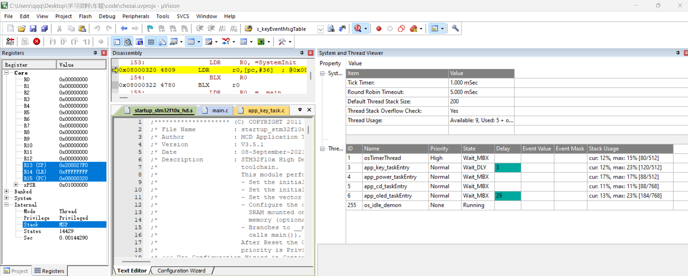

# stm32key

基于 STM32F103RC 和 Keil MDK 的按键、状态机与 OLED 显示示例工程。工程使用 CMSIS-RTOS RTX 组织多任务，通过消息队列和 Mail 队列把按键、电源、CD 状态机和 OLED 显示模块解耦。

## 工程概览

- 主控: STM32F103RC, Cortex-M3, 72 MHz
- 工程文件: `chezai.uvprojx`
- 目标名: `Target 1`
- 输出名: `chezai`, 构建后生成 `Objects/chezai.hex`
- RTOS: CMSIS-RTOS RTX
- 显示: I2C OLED, 地址 `0x78`, SCL `PB6`, SDA `PB7`
- 按键: `WKUP` 位于 `PA0`, `KEY0` 位于 `PC1`, `KEY1` 位于 `PC13`

## 功能

- 三路按键扫描，支持短按、长按和释放事件。
- `WKUP` 短按开机，`WKUP` 长按关机。
- `KEY0` 短按执行装载或弹出，长按切换上一曲。
- `KEY1` 短按播放或暂停，长按切换下一曲。
- CD 状态机覆盖关机、无碟、装载、弹出、停止、播放、暂停等状态。
- OLED 根据电源状态、CD 状态和曲目编号刷新显示，并带有开机显示/动画入口。
- 独立看门狗初始化，降低任务异常卡死风险。

## 目录结构

```text
App/
  App_CD/       CD 状态机和 CD 任务
  App_KEY/      按键扫描、消抖、长按定时
  App_OLED/     OLED 显示任务和动画
  App_Power/    电源状态任务
BSP/            GPIO、按键、OLED I2C、IWDG 等板级驱动
Common/         公共类型、错误码、配置和消息封装
Core/           main 入口与任务、队列创建
RTE/            Keil RTE 与 CMSIS-RTOS 配置
DebugConfig/    Keil 调试配置
```

根目录下的中文 Markdown 文档记录了模块状态机、线程通信和按键到 OLED 的数据链路，适合配合源码阅读。

## 模块通信

`Core/main.c` 创建全局消息池、三个消息队列和一个 CD 到 OLED 的 Mail 队列:

- `g_powerMsgQueue`: 接收按键触发的电源事件。
- `g_cdMsgQueue`: 接收电源状态、按键事件和 CD 内部定时事件。
- `g_oledMsgQueue`: 接收电源状态和刷新事件。
- `g_cdOledMailQueue`: CD 任务向 OLED 任务上报状态、显示模式和曲目编号。

`Common/app_msg.c` 负责从消息池分配 `AppMsg`，投递到目标队列，并在消费后释放，避免各任务直接共享临时栈数据。

## 线程创建说明

本工程里常说的“创建进程”，在 CMSIS-RTOS RTX 中更准确地叫创建线程或任务。线程在 `Core/main.c` 中定义和启动。

线程定义代码如下:

```c
osThreadDef(app_key_taskEntry,   osPriorityNormal, 1U, TASK_KEY_STACK_SIZE);
osThreadDef(app_power_taskEntry, osPriorityNormal, 1U, TASK_POWER_STACK_SIZE);
osThreadDef(app_cd_taskEntry,    osPriorityNormal, 1U, TASK_CD_STACK_SIZE);
osThreadDef(app_oled_taskEntry,  osPriorityNormal, 1U, TASK_OLED_STACK_SIZE);
```

`osThreadDef(name, priority, instances, stacksz)` 的含义如下:

| 参数 | 本工程示例 | 含义 |
| --- | --- | --- |
| `name` | `app_oled_taskEntry` | 线程入口函数名。入口函数原型为 `void xxx(void const *argument)`。 |
| `priority` | `osPriorityNormal` | 线程优先级。四个业务线程都使用普通优先级，便于按消息和定时器协同运行。 |
| `instances` | `1U` | 允许创建的线程实例数量。这里每个模块只需要一个任务实例。 |
| `stacksz` | `TASK_OLED_STACK_SIZE` | 该线程的私有栈大小，单位按 CMSIS-RTOS 接口写为 byte。 |

注意: `osThreadDef` 只是生成线程描述符，并不会真正运行线程。真正启动线程的是 `sys_task_init()` 里的 `osThreadCreate`:

```c
s_keyQueues[0] = g_cdMsgQueue;
s_keyQueues[1] = g_powerMsgQueue;

osThreadCreate(osThread(app_key_taskEntry), (void *)s_keyQueues);
osThreadCreate(osThread(app_power_taskEntry), NULL);
osThreadCreate(osThread(app_cd_taskEntry), NULL);
osThreadCreate(osThread(app_oled_taskEntry), NULL);
```

`osThreadCreate(osThread(name), argument)` 中，`osThread(name)` 取出前面 `osThreadDef` 生成的线程描述符，`argument` 会传给入口函数的 `argument` 参数。按键任务需要同时向 CD 队列和电源队列发送消息，所以传入 `s_keyQueues`；电源、CD、OLED 任务使用全局队列句柄，不需要额外入口参数，所以传 `NULL`。

## KEY 任务栈大小依据

线程栈大小集中定义在 `Common/com_config.h`:

```c
#define TASK_KEY_STACK_SIZE         512U
#define TASK_POWER_STACK_SIZE       512U
#define TASK_CD_STACK_SIZE          768U
#define TASK_OLED_STACK_SIZE        768U
```

这里重点说明 `app_key_taskEntry` 为什么是 `512U`。

```c
void app_key_taskEntry(void const *argument)
{
    const osMessageQId *queues = (const osMessageQId *)argument;

    ...

    for (;;)
    {
        app_key_scan();
        osDelay(KEY_SCAN_INTERVAL_MS);
    }
}
```

`TASK_KEY_STACK_SIZE = 512U` 表示给 KEY 任务分配 512 bytes 私有栈。这个栈不是用来保存整个按键模块的全部状态，而是保存这个线程运行过程中临时产生的内容。

KEY 任务栈里主要会放这些内容:

| 来源 | 栈上内容 | 大小特点 |
| --- | --- | --- |
| `app_key_taskEntry` | `queues` 指针，以及调用 `osTimerCreate`、`bsp_key_init`、`app_key_scan`、`osDelay` 时的返回地址和寄存器保存 | 局部变量很少，主要是调用开销 |
| `app_key_scan` | `rawState[BSP_KEY_COUNT]`、`wkupDown`、`key0Down`、`key1Down`、`keyIndex`、`track`，释放按键时还有 `longReported`、`holdTimeMs` | `BSP_KEY_COUNT = 3`，局部数组只有 3 个字节，其他多为 1 字节变量和指针 |
| `app_key_report_release` | 参数和少量分支调用开销 | 不创建大数组 |
| `app_key_send_event` | `targetQueue` 指针，以及调用 `app_msg_send` 的开销 | 不复制大块数据 |
| `app_msg_send` | `copy` 指针，以及 `osPoolAlloc`、`osMessagePut` 调用开销 | 真正的 `AppMsg` 从全局消息池 `g_appMsgPool` 分配，不放在 KEY 任务栈里 |

下面这些内容不占 `TASK_KEY_STACK_SIZE`:

- `s_keyTrack[BSP_KEY_COUNT]`: `static` 变量，放在静态存储区，用来记录每个按键的消抖、确认、长按和按下时间。
- `s_suppressed[BSP_KEY_COUNT]`: `static` 变量，放在静态存储区，用来屏蔽组合键冲突。
- `s_cdQueue`、`s_powerQueue`、`s_longTimer[BSP_KEY_COUNT]`: `static` 变量，放在静态存储区，保存队列和定时器句柄。
- `s_keyEventMsgTable`、`s_shortEvent`、`s_longEvent`、`s_offEvent`: `static const` 表，放在只读/静态存储区。
- 发出去的 `AppMsg`: 由 `app_msg_send` 从 `g_appMsgPool` 申请，消息内容进入全局消息池，不压在 KEY 任务栈上。

所以 KEY 任务的实际栈压力比较小: 它没有大数组、没有递归、没有格式化打印，主要是按键扫描和 RTOS API 调用。

Keil 已生成静态调用图文件 `Objects/chezai.htm`，其中给出的最大栈深如下:

```text
Maximum Stack Usage = 128 bytes + Unknown(Functions without stacksize, Cycles, Untraceable Function Pointers)

Call chain for Maximum Stack Depth:
app_key_taskEntry -> app_key_scan -> app_key_report_release -> app_key_send_event
-> app_msg_send -> osMessagePut -> isrMessagePut -> isr_mbx_send -> rt_psq_enq
```

跟 KEY 模块相关的函数栈深如下，其中 `app_key_long_timer_cb` 是 RTX 软件定时器回调，不在 `app_key_taskEntry` 主循环路径里:

| 函数 | Keil 报告的自身栈 | Keil 报告的最大调用深度 |
| --- | ---: | ---: |
| `app_key_taskEntry` | 0 bytes | 128 bytes |
| `app_key_scan` | 40 bytes | 128 bytes |
| `app_key_report_release` | 16 bytes | 88 bytes |
| `app_key_send_event` | 16 bytes | 72 bytes |
| `app_msg_send` | 16 bytes | 56 bytes |
| `app_key_long_timer_cb` | 16 bytes | 88 bytes |

因此，`TASK_KEY_STACK_SIZE = 512U` 的依据是: Keil 静态调用图报告 `app_key_taskEntry` 当前最大栈深为 128 bytes，而实际分配 512 bytes，余量为 `512 - 128 = 384 bytes`，也就是 4 倍于当前最大静态栈深。这个余量用于覆盖调试编译差异、RTX 内部未知栈信息以及后续少量代码调整。

RTX 配置在 `RTE/CMSIS/RTX_Conf_CM.c`，关键项如下:

```c
#define OS_TASKCNT      8
#define OS_STKSIZE      50
#define OS_PRIVCNT      4
#define OS_PRIVSTKSIZE  768
#define OS_STKCHECK     1
```

依据说明:

- `OS_TASKCNT = 8`: RTX 允许同时运行的用户线程数量。本工程创建 4 个业务线程，数量小于 8。
- `OS_STKSIZE = 50`: 默认线程栈大小。配置注释说明这是 word 单位，因此是 `50 * 4 = 200 bytes`。如果 `osThreadDef` 的 `stacksz` 写 0，就会使用这个默认值。本工程没有用默认值，而是为每个业务线程显式指定 512 或 768 bytes。
- `OS_PRIVCNT = 4`: 使用自定义栈大小的线程数量。本工程正好有 4 个 `osThreadDef(..., TASK_xxx_STACK_SIZE)`，所以配置为 4。
- `OS_PRIVSTKSIZE = 768`: 自定义线程栈池总大小。配置注释说明这是 word 单位，因此是 `768 * 4 = 3072 bytes`。
- 本工程四个线程实际申请的栈总量是 `512 + 512 + 768 + 768 = 2560 bytes`，换算为 `640 words`，小于 `OS_PRIVSTKSIZE` 的 `768 words`，还剩 `128 words = 512 bytes` 余量。
- `OS_STKCHECK = 1`: RTX 在线程切换时启用栈溢出检查。后续如果在 KEY 任务里新增较大的局部数组、递归调用或复杂打印，应重新评估 `TASK_KEY_STACK_SIZE`。

## RTX5 到 RTX v1 迁移记录

本工程当前使用的是经典 RTX，也就是 CMSIS-RTOS v1 接口，不是 RTX5/RTOS2。迁移时主要改动如下:

| 位置 | 改动 |
| --- | --- |
| `chezai.uvprojx` | RTE 组件从 `CMSIS:RTOS2:Keil RTX5` 切到 `CMSIS:RTOS:Keil RTX`。 |
| `chezai.uvprojx` | 链接库使用 `CMSIS\RTOS\RTX\LIB\ARM\RTX_CM3.lib`。 |
| `RTE/CMSIS/RTX_Conf_CM.c` | 使用 RTX v1 配置文件，替代 RTX5 的 `RTX_Config.c` / RTOS2 兼容层配置。 |
| `Core/main.c` | 去掉手动 `osKernelInitialize()` / `osKernelStart()` 流程。经典 RTX v1 会把 `main()` 作为线程启动。 |
| `Core/main.c` | `main()` 初始化系统、队列和业务线程后，调用 `osThreadTerminate(osThreadGetId())` 结束自身线程。 |
| `RTE/CMSIS/RTX_Conf_CM.c` | `OS_CLOCK` 配为 `72000000`，与 STM32F103 当前 72 MHz 系统时钟一致。 |
| `RTE/CMSIS/RTX_Conf_CM.c` | `os_idle_demon()` 中喂独立看门狗，适配 RTX v1 的 idle hook 名称。 |
| `RTE/CMSIS/RTX_Conf_CM.c` | 打开私有线程栈池: `OS_PRIVCNT = 4`，`OS_PRIVSTKSIZE = 768` words。 |

屏幕从 RTX5 切到 RTX 后不亮的主要原因是: RTX v1 下 `osThreadDef(..., stacksize)` 只要 `stacksize` 非 0，就会走私有线程栈池。如果 `OS_PRIVCNT` / `OS_PRIVSTKSIZE` 还是 0，业务线程会创建失败，OLED 任务不会真正跑起来。现在四个业务线程都显式配置了栈，私有栈池也已经打开。

当前可以从这些位置确认工程使用的是 RTX v1:

| 证据 | 位置 |
| --- | --- |
| RTE 组件是 `CMSIS` / `RTOS` / `Keil RTX` | `chezai.uvprojx:498` |
| RTX v1 配置文件实例是 `RTE\CMSIS\RTX_Conf_CM.c` | `chezai.uvprojx:512` - `chezai.uvprojx:514` |
| RTE 宏是 `RTE_CMSIS_RTOS_RTX` | `RTE/_Target_1/RTE_Components.h:21` |
| 编译依赖包含 `CMSIS\RTOS\RTX\INC\cmsis_os.h` | `Objects/main.d:10` |
| 链接库是 `CMSIS\RTOS\RTX\LIB\ARM\RTX_CM3.lib` | `Objects/chezai.lnp:14` |
| 链接对象包含 `rtx_conf_cm.o` | `Objects/chezai.lnp:15` |
| `main()` 结束自身线程 | `Core/main.c:74`、`Core/main.c:87` |

`RTE/CMSIS/RTX_Config.c`、`RTE/CMSIS/RTX_Config.h` 即使还在目录里，也不是当前活动构建使用的 RTX v1 配置入口；当前活动构建看 `RTX_Conf_CM.c` 和 `RTX_CM3.lib`。

## 全线程栈深记录

Keil 静态调用图文件是 `Objects/chezai.htm`。总的最大栈深在 `Objects/chezai.htm:8`，最大路径在 `Objects/chezai.htm:9` - `Objects/chezai.htm:10`:

```text
Maximum Stack Usage = 128 bytes + Unknown(Functions without stacksize, Cycles, Untraceable Function Pointers)

Call chain for Maximum Stack Depth:
app_key_taskEntry -> app_key_scan -> app_key_report_release -> app_key_send_event
-> app_msg_send -> osMessagePut -> isrMessagePut -> isr_mbx_send -> rt_psq_enq
```

业务线程的静态最大栈深如下:

| 线程入口 | 配置栈 | Keil 静态最大深度 | 报告位置 | 最大调用链摘要 |
| --- | ---: | ---: | --- | --- |
| `app_key_taskEntry` | 512 bytes | 128 bytes | `Objects/chezai.htm:716` - `Objects/chezai.htm:717` | `app_key_scan -> app_key_report_release -> app_key_send_event -> app_msg_send -> osMessagePut` |
| `app_power_taskEntry` | 512 bytes | 96 bytes | `Objects/chezai.htm:798` - `Objects/chezai.htm:799` | `app_power_msg_handle -> app_power_enter_state -> app_power_notify_oled -> app_msg_send -> osMessagePut` |
| `app_cd_taskEntry` | 768 bytes | 84 bytes | `Objects/chezai.htm:705` - `Objects/chezai.htm:706` | `app_cd_msg_handle -> app_cd_report_state -> osMailFree -> sysMailFree` |
| `app_oled_taskEntry` | 768 bytes | 120 bytes | `Objects/chezai.htm:781` - `Objects/chezai.htm:782` | `app_oled_init -> app_oled_render -> bsp_oled_iic_refresh -> bsp_oled_write` |
| `main` | `OS_MAINSTKSIZE = 128 words` | 88 bytes | `Objects/chezai.htm:952` - `Objects/chezai.htm:953` | `sys_task_init -> osThreadCreate -> svcThreadCreate -> rt_tsk_create` |
| `osTimerThread` | `OS_TIMERSTKSZ = 128 words` | 40 bytes | `Objects/chezai.htm:1125` - `Objects/chezai.htm:1126` | `osMessageGet -> isrMessageGet -> isr_mbx_receive` |

软件定时器回调不是独立业务线程，一般由 RTX timer thread 调度，但 Keil 调用图也单独列出了它们的可见最大深度:

| 回调 | Keil 静态最大深度 | 报告位置 | 最大调用链摘要 |
| --- | ---: | --- | --- |
| `app_key_long_timer_cb` | 88 bytes | `Objects/chezai.htm:1772` - `Objects/chezai.htm:1773` | `app_key_send_event -> app_msg_send -> osMessagePut` |
| `app_cd_disc_timer_cb` | 80 bytes | `Objects/chezai.htm:1826` - `Objects/chezai.htm:1827` | `app_cd_send_self_event -> app_msg_send -> osMessagePut` |
| `app_cd_repeat_timer_cb` | 80 bytes | `Objects/chezai.htm:1869` - `Objects/chezai.htm:1870` | `app_cd_send_self_event -> app_msg_send -> osMessagePut` |
| `app_oled_power_on_timer_cb` | 80 bytes | `Objects/chezai.htm:2051` - `Objects/chezai.htm:2052` | `app_oled_send_refresh_event -> app_msg_send -> osMessagePut` |

注意: 这些数值是 Keil 静态分析能看到的路径。报告顶部仍然带有 `Unknown(Functions without stacksize, Cycles, Untraceable Function Pointers)`，所以后续如果新增大局部数组、递归、复杂 `printf` 或不可追踪函数指针，应重新生成 `Objects/chezai.htm` 再评估栈大小。

## 动态栈深查看

`RTE/CMSIS/RTX_Conf_CM.c` 中已打开栈水印:

```c
#define OS_STKINIT      1
```

进入 Keil Debug 后，打开 `Debug -> OS Support -> RTX Tasks and System`，查看 `Stack Usage` 的 `max` 值。



本次截图中的动态最大值:

| 线程 | 动态最大栈用量 |
| --- | ---: |
| `osTimerThread` | 80 / 512 bytes |
| `app_key_taskEntry` | 120 / 512 bytes |
| `app_power_taskEntry` | 88 / 512 bytes |
| `app_cd_taskEntry` | 88 / 768 bytes |
| `app_oled_taskEntry` | 184 / 768 bytes |

结论: 当前栈配置比较宽。若完整跑过所有按键、定时器和 OLED 场景后数值仍接近本表，KEY / POWER 可考虑降到 384 bytes，OLED / CD 可继续保守保留 768 bytes，或再结合后续功能压缩。

## 构建方法

1. 安装 Keil MDK 5，并确保包含 STM32F1 设备包和 ARM Compiler 5。
2. 使用 Keil uVision 打开 `chezai.uvprojx`。
3. 选择 `Target 1`。
4. 执行 Build 或 Rebuild。
5. 构建产物位于 `Objects/`，其中 `chezai.hex` 可用于烧录。

也可以在已配置 Keil 命令行环境的机器上使用类似命令构建:

```powershell
UV4.exe -b .\chezai.uvprojx -t "Target 1"
```

## 主要配置

常用参数集中在 `Common/com_config.h`:

- `KEY_SCAN_INTERVAL_MS`: 按键扫描周期，默认 10 ms。
- `KEY_PRESS_SAMPLES`: 按键确认采样次数，默认 3 次。
- `KEY_LONG_PRESS_MS`: 长按阈值，默认 1700 ms。
- `CD_DISC_ACTION_MS`: 装载/弹出模拟动作时间，默认 3000 ms。
- `CD_REPEAT_INTERVAL_MS`: 长按连跳间隔，默认 500 ms。
- `CD_MUSIC_MIN` / `CD_MUSIC_MAX`: 曲目范围，默认 1 到 100。

## 版本管理说明

仓库只提交源码、工程配置和设计文档。`Objects/`、`Listings/`、`*.hex`、`*.axf`、Keil 用户界面状态文件以及本地工具缓存会被 `.gitignore` 排除。
